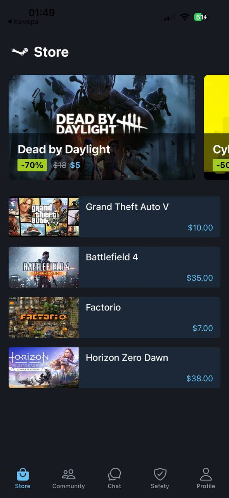
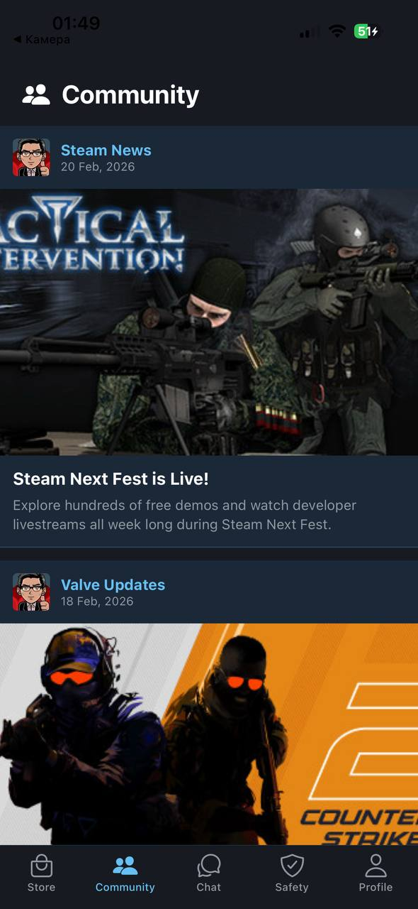
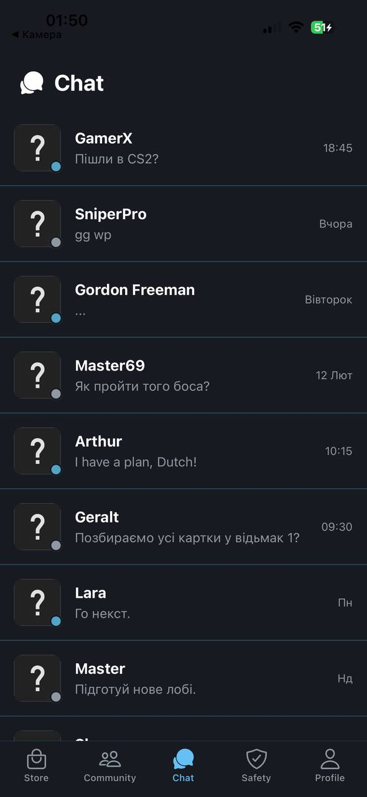
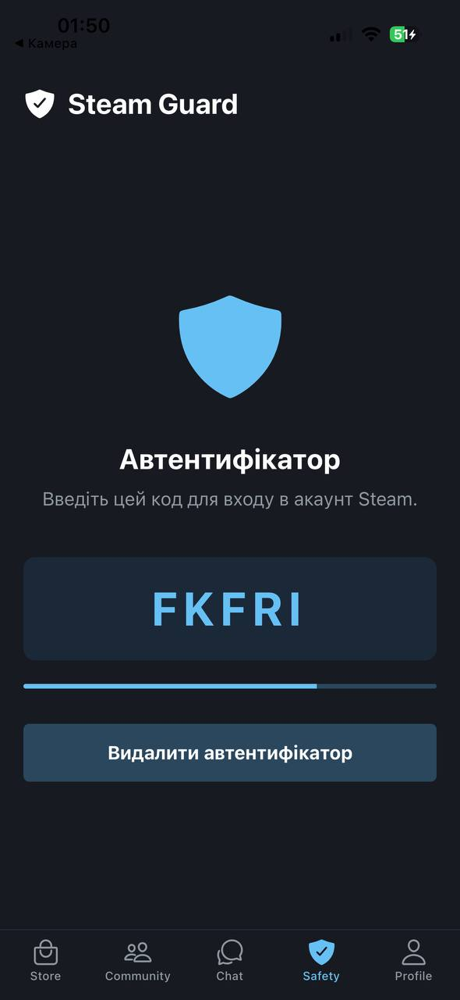
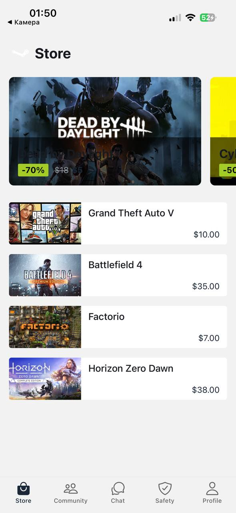
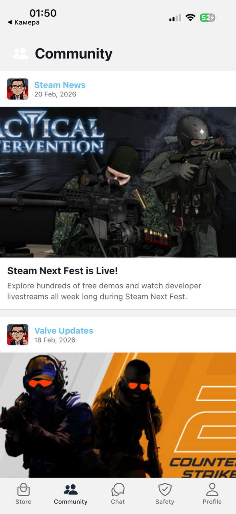
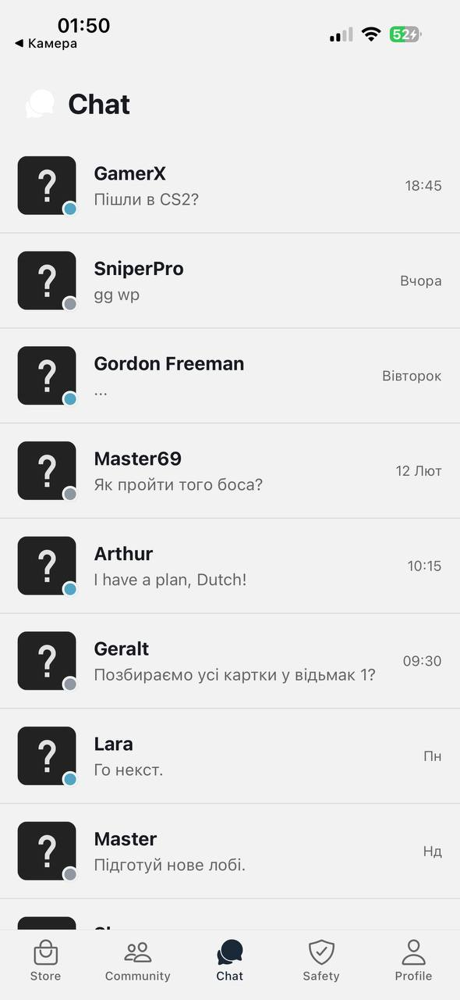
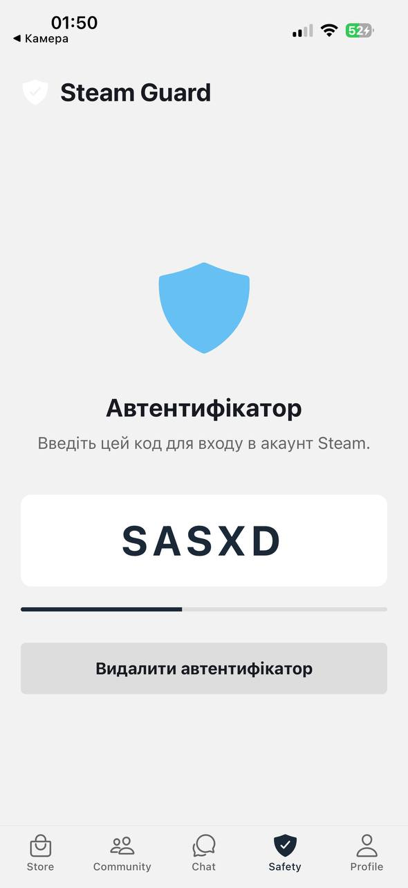

## Інструкція по запуску проекту

1. Встановити залежності

   ```bash
   npm install
   ```

2. Запуск

   ```bash
   npx expo start
   ```

### Опис сторінок застосунку

1. Магазин (Store Screen)

Головна сторінка каталогу ігор.
Містить горизонтальну галерею (карусель) рекомендованих проєктів зі знижками та вертикальний список ігор із цінами та обкладинками.


2. Спільнота (Community Screen)

Стрічка новин ігрового світу та оновлень.
Реалізована у вигляді повноцінних постів з великими зображеннями, текстом, датою публікації та інформацією про авторів.


3. Чат (Chat Screen)

Список друзів та повідомлень користувача.
Відображає аватари, імена, текст останнього повідомлення, час відправлення та динамічні індикатори статусу.


4. Безпека (Safety Screen)

Екран двофакторної автентифікації акаунта Steam Guard.
Містить динамічний генератор 5-значних кодів підтвердження з анімованою смужкою прогресу та кнопку керування автентифікатором.


5. Профіль користувача (Profile Screen)

Особистий кабінет гравця.
Відображає аватар, поточний рівень Steam, блок нещодавньої активності в іграх та глобальний перемикач теми застосунку.


6. Демонстрація світлої теми (Light Mode)

Застосунок підтримує глобальне перемикання тем. Нижче наведено вигляд усіх екранів у світлій темі:

1. Магазин


2. Спільнота


3. Чат


4. Безпека


5. Профіль
