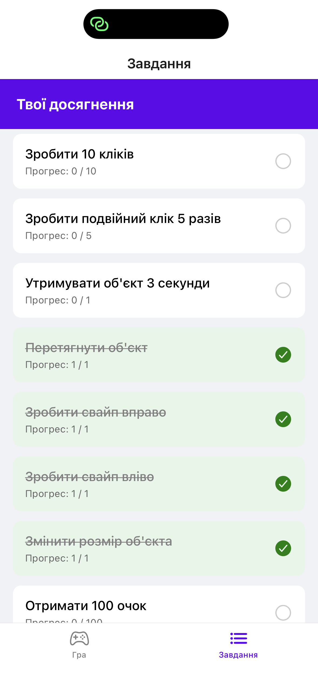
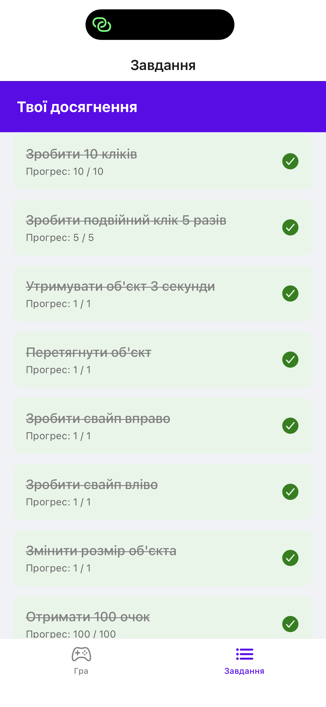
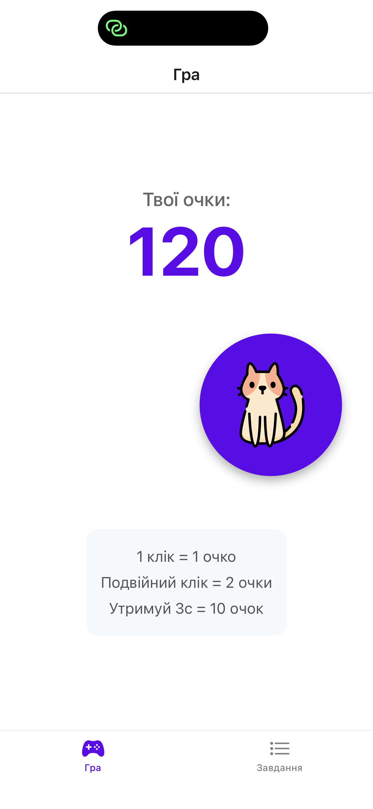
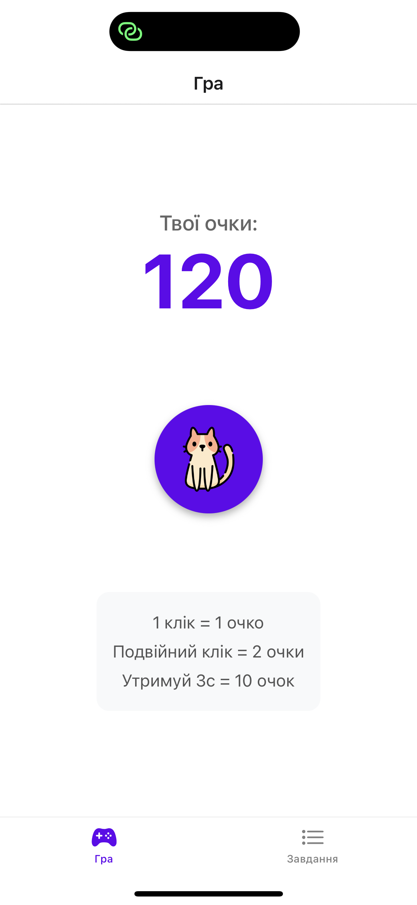

# Лабораторна робота №3: Інтерактивний Клікер з Жестами 

## Мета роботи
Розробка мобільного додатка з використанням бібліотеки react-native-gesture-handler для обробки складних жестів, впровадження системи глобального стану через Context API та оптимізованого виводу даних за допомогою FlatList.

## Реалізований функціонал
* **Обробка базових жестів:** реалізовано одинарний клік (Tap), подвійний клік (Double Tap) із запобіганням конфліктам через `waitFor`, а також довге натискання (Long Press).
* **Обробка складних жестів:** додано перетягування ігрового об'єкта (Pan), зміну масштабу двома пальцями (Pinch) та швидкі свайпи (Fling). Вирішено конфлікт одночасного спрацьовування жестів Pan та Fling.
* **Анімації:** використано Animated API (`Animated.spring`) для плавного повернення об'єкта в початковий стан після взаємодії.
* **Глобальний стан:** налаштовано Context API (`GameContext`) для централізованого збереження рахунку гравця та масиву досягнень.
* **Списки:** використано компонент FlatList для оптимізованого відображення екрана завдань із динамічним оновленням стилів виконаних пунктів.
* **Навігація:** реалізовано Bottom Tab Navigation для перемикання між екранами.

## Скріншоти додатка

1. Головний екран гри


2. Екран завдань


3. Екран виконаних усіх завдань


4. Екран гри (можливість свайпу клікера)


5. Екран гри (можливість звужувати розміри клікера)


## Інструкція із запуску
1. Встановіть залежності проєкту:
   ```bash
   npm install