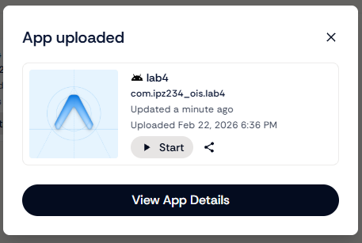
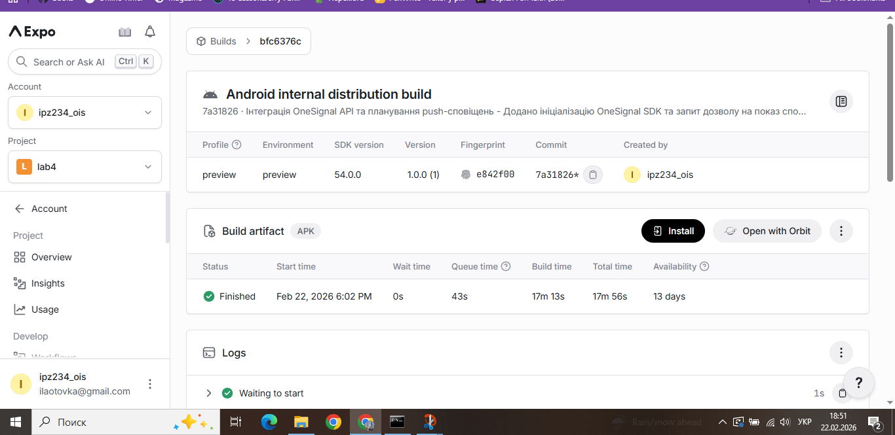
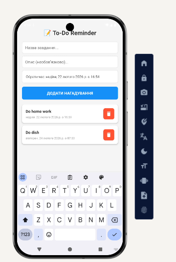
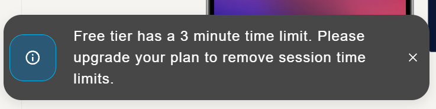

## Опис проєкту
Додаток "To-Do Reminder" — це менеджер завдань із можливістю створення відкладених push-сповіщень. Користувач може додати нове завдання, вказати його опис та обрати точну дату і час для нагадування. Інтеграція сповіщень реалізована за допомогою хмарного сервісу OneSignal.

## Важлива примітка щодо тестування
> Логіка POST та DELETE запитів до OneSignal API реалізована повністю. Протестовано через хмарну збірку Expo (APK). Через використання iOS як основного пристрою та відсутність Google Play Services у веб-емуляторі Appetize.io, пуш-сповіщення не змогло бути доставлене віртуальному пристрою, але код повністю робочий.

## Основний функціонал
* Створення завдань із вказанням назви та опису.
* Вибір дати та часу нагадування за допомогою компонента `react-native-date-picker`.
* Відправка POST-запиту до OneSignal API для планування відкладеного push-сповіщення (`send_after`).
* Видалення завдань зі списку з одночасною відправкою DELETE-запиту для скасування запланованого сповіщення.

## Технології
* React Native (Expo)
* OneSignal SDK (`react-native-onesignal`)
* OneSignal REST API
* Хмарна збірка Expo EAS (`eas-cli`)

## Скріншоти роботи
Успішна збірка та робота інтерфейсу додатка:

