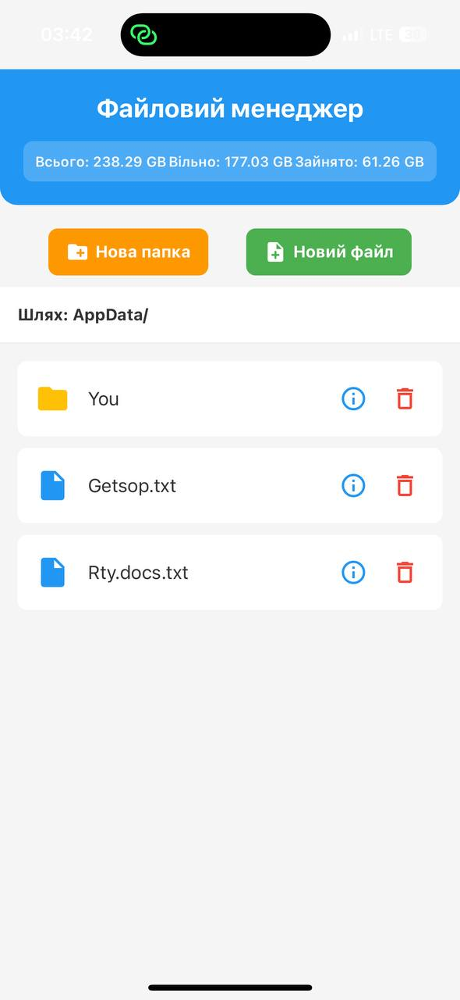
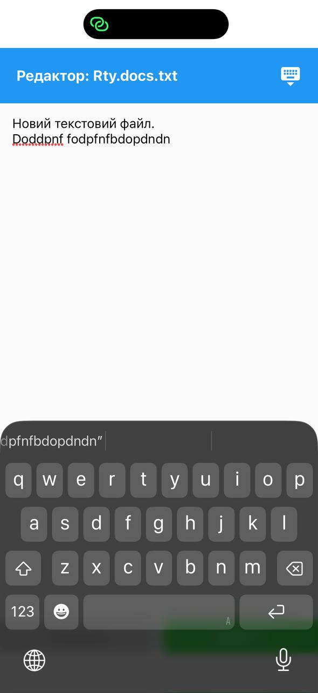
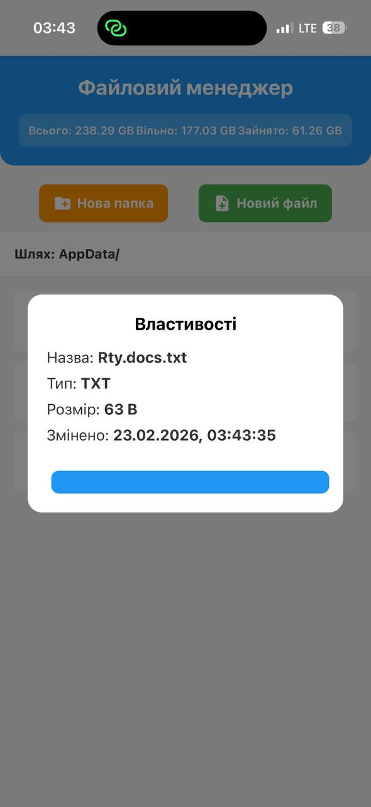

## Опис проєкту
Мобільний застосунок "Файловий менеджер", розроблений на React Native (Expo). Додаток дозволяє керувати локальною файловою системою пристрою в межах ізольованої директорії `AppData`.

## Реалізований функціонал
1. **Навігація:** перегляд вмісту папок, перехід у вкладені директорії та повернення на рівень вище.
2. **Статистика пам'яті:** відображення загального, вільного та зайнятого простору пристрою на головному екрані.
3. **Створення:** додавання нових папок та створення порожніх текстових `.txt` файлів.
4. **Читання та Редагування:** відкриття текстових файлів, модифікація їх вмісту та збереження змін.
5. **Видалення:** видалення файлів і папок із попереднім вікном підтвердження.
6. **Інформація:** перегляд детальних атрибутів (назва, тип, розмір, дата останньої зміни).

## Технології
* React Native
* Expo
* `expo-file-system` (для роботи з локальними файлами)

## Скріншоти роботи

