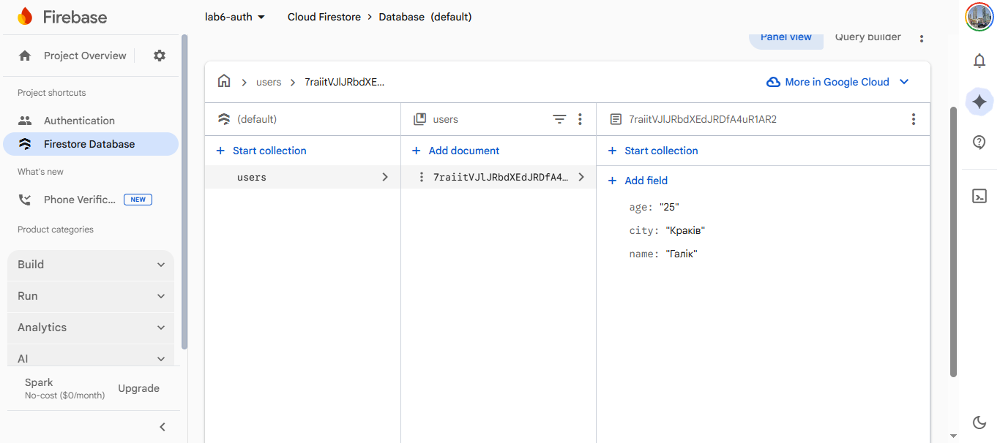
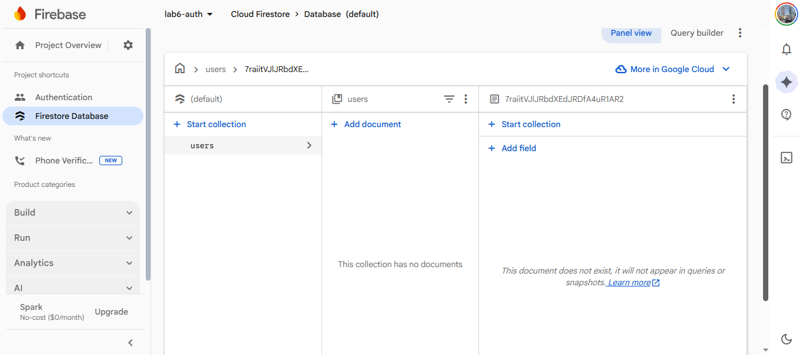
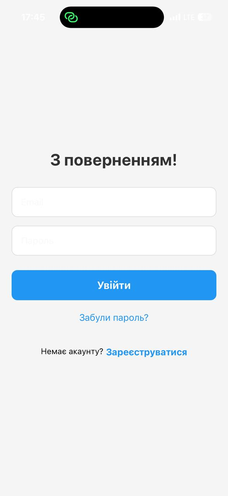
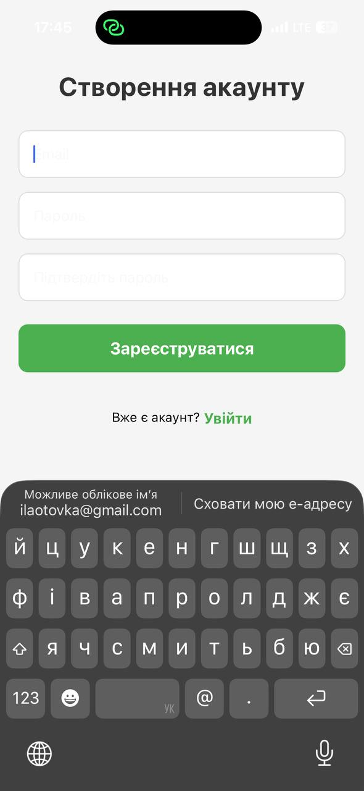
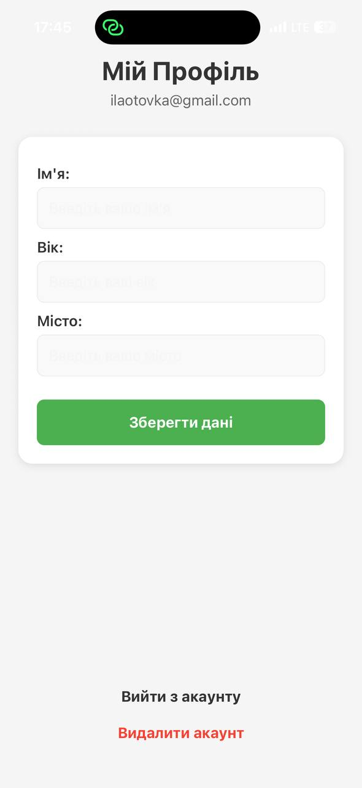
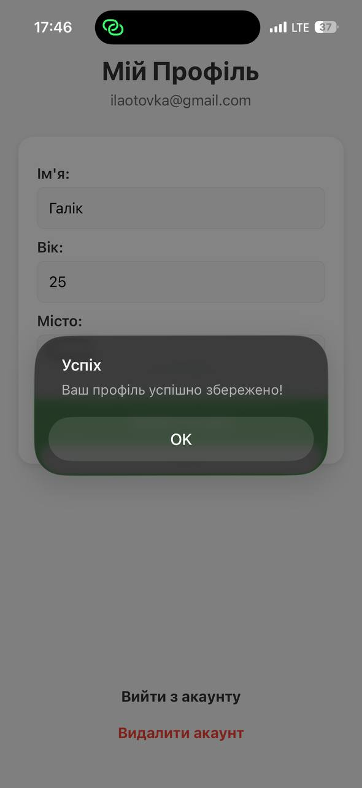

**Опис проєкту**
Мобільний додаток, що реалізує систему авторизації користувачів через Firebase та збереження їхніх персональних даних у хмарному сховищі Cloud Firestore з перевіркою прав доступу.

**Реалізований функціонал:**
- Реєстрація, авторизація та вихід із системи.
- Збереження сесії користувача (через AsyncStorage).
- Відновлення забутого пароля через email.
- Збереження та редагування профілю (ім'я, вік, місто) у Firestore.
- Видалення акаунту з бази даних із попередньою повторною автентифікацією.

**Технології:**
- React Native
- Expo
- Firebase Authentication
- Cloud Firestore
- AsyncStorage
- React Navigation

**Скріншоти роботи додатку:**

1. Скріншот 1:

2. Скріншот 2:

3. Скріншот 3:

4. Скріншот 4:

5. Скріншот 5:

6. Скріншот 6:

7. Скріншот 7:

8. Скріншот 8:
